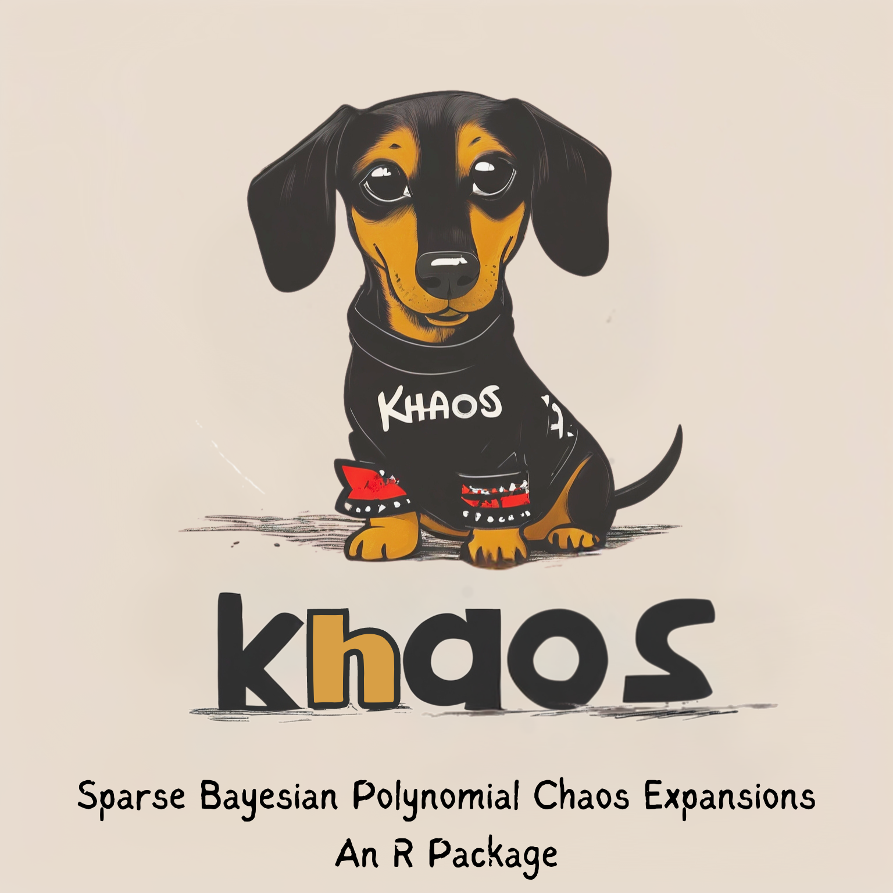

khaos
================

[](https://opensource.org/licenses/BSD-3-Clause)
[](https://github.com/knrumsey/khaos)

<!-- README.md is generated from README.Rmd. Please edit that file -->

    ## Warning: package 'lhs' was built under R version 4.3.3

<div class="figure">


<p class="caption">
This logo was designed by Imagine AI Art Studio
</p>

</div>

### Installation

To install this package, use

``` r
# install.packages("devtools")
devtools::install_github("knrumsey/khaos")
```

The `README.Rmd` file can be knit locally for proper rendering of the
equations. Will add a link here if I ever write a short paper for this.

### Description

The `khaos` R package provides two implementations of Bayesian
polynomial chaos expansions. The methods are referred to as “sparse” and
“adaptive” and can be accessed with the R commands

    sparse_khaos()
    adapative_khaos()

Sparse khaos is an efficient implementation of the Bayesian Sparse
Polynomial Chaos Expansion method of Shao et al. (2017) and adaptive
khaos refers to a modification of the RJMCMC algorithm described by
Francom & Sanso (2020) originally for BMARS.

### Sparse Khaos

The user provides a $n\times p$ matrix of covariates (scaled to the unit
hypercube) `X` and a $n$-vector `y` of the scalar response. The user
also provides an initial value for the maximum polynomial degree $d$ and
the maximum order of interaction $q$. There are

$$|\mathcal A| =\sum_{i=1}^q\sum_{j=i+1}^d \binom{p}{i}\binom{j-1}{i-1} \equiv N_\alpha$$

permissible basis functions to consider. The algorithm consists of the
following steps:

1.  Compute the sample correlation $r_j$ between each basis column
    $\phi_j$ and $y$. Reorder the basis functions so that
    $r_j^2 \geq r_={j+1}^2$.

2.  Perform LASSO (using `glmnet::glmnet`) using the default settings.
    Take $\lambda$ to be the smallest value (least regularization) so
    that the number of selected basis columns $N_\alpha$ is less than or
    equal to the number of training samples $n$. *Note: This step is
    optional and can be turned off by setting `regularize = FALSE`. This
    step is not in Shao’s original algorithm, but can be essential for
    fast computation when* $p$ is moderate or large.

3.  Compute the squared partial correlation coefficient (SPCC)
    $\rho^2_{j|1,\ldots, j-1}$ for each $j=1, \ldots, N_\alpha$. Reorder
    the basis functions again in descending order of SPCC. *Optional:
    (Not in Shao’s original algorithm):* Throw away any basis functions
    with $\rho^2_{j|1,\ldots, j-1} < \rho_0$ (input `rho`).

4.  Consider all BSPCE models with basis functions
    $\phi_1, \ldots, \phi_k$ for $k=1, \ldots N_\alpha$. Calculate the
    Kashyap information criterion (KIC) for each model (using a Laplace
    approximation for the posterior). The codes `lambda` input can be
    used alter the KIC, with larger values favoring models with fewer
    parameters.

5.  If the model contains basis functions with degree equal to $d$ or
    $d-1$, run the algorithm again after setting $d \leftarrow d+2$ and
    $q \leftarrow q + 1$. To bound the computational complexity, the
    recursion is terminated and the model is returned whenever $d +2 >$
    `max_degree`, or when $|A| >$ `max_basis`.

### Changes to algorithm

1.  We note that the MAP-finding procedure described in equation
    (40)-(44) in Shao et al., (2017) is unnecessary because the MAP’s
    can be found without needing iteration.

2.  We also question the definition of ${\bf C}_{aa}$ given right after
    equation (39). We suggest the following definition,
    $\sigma_\alpha^2 = \left(1 + q_\alpha(d_\alpha+q_\alpha-2) \right)^{-1}$
    where $d_\alpha$ and $q_\alpha$ are the *degree* and *order*
    (respectively) implied by $\alpha$.

3.  We propose a conjugate g-prior based approach (Zellner, 1986)
    modified to account for ${\bf C}_{aa}$. The prior distributions
    become

    $$
    \begin{aligned}
    {\bf a}|\sigma^2 &\sim N\left({\bf 0}, \frac{\sigma^2n}{n_0}{\bf C}_{aa}\left(\Phi^T\Phi\right)^{-1} \right)\\
    \sigma^2 &\sim \text{Inv-Gamma}\left(\frac{v_0}{2}, \frac{s_0^2}{2} \right),
    \end{aligned}
    $$

    where $\Phi$ is the $n\times N_\alpha$ matrix of basis functions and
    $n_0, v_0, s_0$ are user-defined hyperparameters. In this setting,
    the posterior distribution becomes

    $$
    \begin{aligned}{\bf a} \mid \sigma^2, {\bf y} &\sim N\left( G_1 \hat{\bf a} , \sigma^2 G_1\left(\Phi^\intercal \Phi\right)^{-1}\right) \\
    \sigma^2 \mid \bf y &\sim \text{Inv}-\text{Gamma}\left(\frac{n+v_0-p}{2}, \frac{s_0^2 + s^2 + G_2\hat{\bf a}^\intercal \Phi^\intercal\Phi\hat{\bf a}}{2}, \right)\end{aligned}
    $$

    where
    $\hat a = \left(\Phi^\intercal \Phi\right)^{-1}\Phi^\intercal {\bf y}$,
    $s^2 = ({\bf y} - \Phi \hat{\bf a})^\intercal ({\bf y} - \Phi \hat{\bf a})$,
    $G_1 = \left(\bf I + \frac{n_0}{n}{\bf C}_{aa}\right)^{-1}$ and
    $G_2 = \left(\bf I + \frac{n}{n_0}{\bf C}_{aa}\right).$ The MAP
    estimates used to evaluate KIC are now given by

    $$
    \begin{aligned}{\hat{\bf a}}_\text{map} &= G_1 \hat{\bf a}\\
    \hat{\sigma}^2_\text{map} &= \frac{s_0^2 + s^2 + G_2\hat{\bf a}^\intercal \Phi^\intercal\Phi\hat{\bf a}}{n+2+v_0 -p}
    \end{aligned}
    $$

    4.  We note that a major advantage of using the g-prior is the
        connection to variable selection. Thus we may be able to avoid
        using KIC altogether. We leave this for future work.

### Adaptive Khaos

Briefly, this algorithm works by building models of the form

$$
f(x) = \sum_{m=1}^M a_m \prod_{i=1}^p \psi_{d_{im}}(x_i)
$$

where $\psi_d(x)$ is the “shifted standardized Legendre polynomial” of
degree $d$. These models are built adaptively from the ground up using a
simplified RJMCMC algorithm with a (i) modification phase in which basis
functions are added (birth step), removed (death step), or modified
(mutation step) and (ii) Gibbs steps for all other model parameters.

The proposal distribution is carefully constructed using what we call
the “Coin flip proposal”, which is a computational enhancement of the
ideas described by Nott et al. (2005).

### Copyright

Reference ID: \#O4792

*© 2024. Triad National Security, LLC. All rights reserved. This program
was produced under U.S. Government contract 89233218CNA000001 for Los
Alamos National Laboratory (LANL), which is operated by Triad National
Security, LLC for the U.S. Department of Energy/National Nuclear
Security Administration. All rights in the program are reserved by Triad
National Security, LLC, and the U.S. Department of Energy/National
Nuclear Security Administration. The Government is granted for itself
and others acting on its behalf a nonexclusive, paid-up, irrevocable
worldwide license in this material to reproduce, prepare. derivative
works, distribute copies to the public, perform publicly and display
publicly, and to permit others to do so.*

### References

Shao, Q., Younes, A., Fahs, M., & Mara, T. A. (2017). Bayesian sparse
polynomial chaos expansion for global sensitivity analysis. Computer
Methods in Applied Mechanics and Engineering, 318, 474-496.

Zellner, A. (1986). On assessing prior distributions and Bayesian
regression analysis with g-prior distributions. *Bayesian inference and
decision techniques*.

Francom, Devin, and Bruno Sansó. “BASS: An R package for fitting and
performing sensitivity analysis of Bayesian adaptive spline
surfaces.” *Journal of Statistical Software* 94.LA-UR-20-23587 (2020).

Nott, David J., Anthony YC Kuk, and Hiep Duc. “Efficient sampling
schemes for Bayesian MARS models with many predictors.” *Statistics and
Computing* 15 (2005): 93-101.
