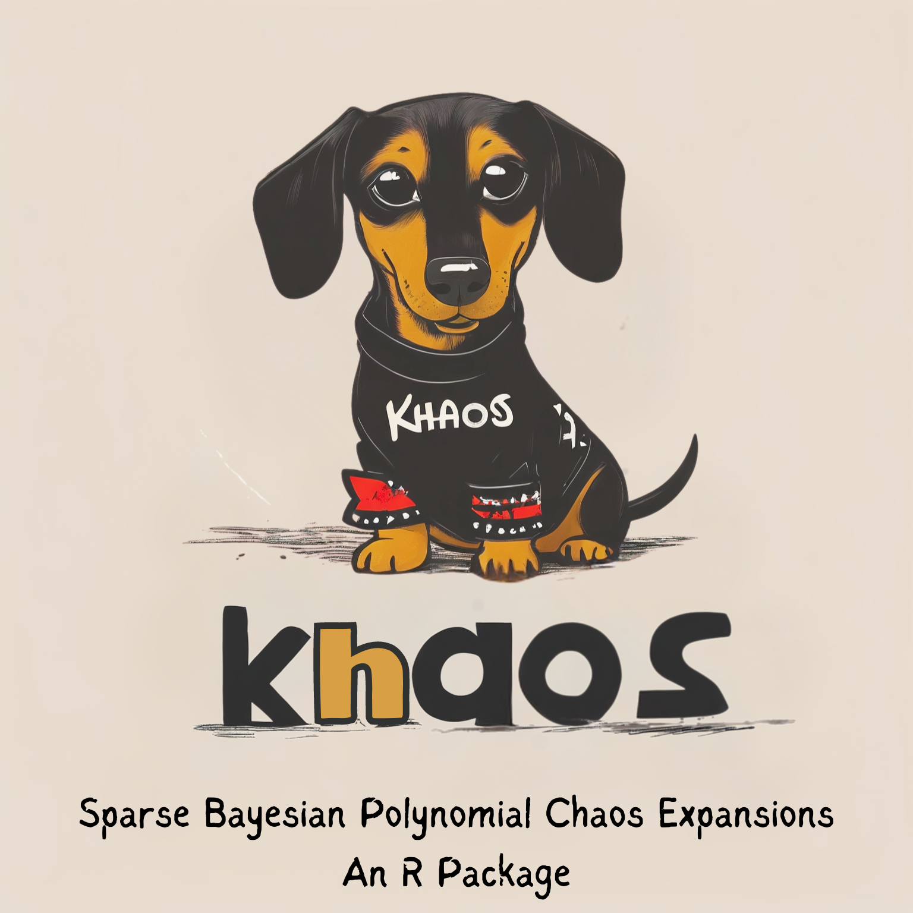

khaos: Bayesian Polynomial Chaos Expansions in R
================

[](https://opensource.org/licenses/BSD-3-Clause)
[](https://github.com/knrumsey/khaos)

<!-- README.md is generated from README.Rmd. Please edit that file -->

<div class="figure">


<p class="caption">

This logo was designed by Imagine AI Art Studio
</p>

</div>

### Installation

To install this package, use

``` r
# install.packages("remotes")
remotes::install_github("knrumsey/khaos")
```

## Overview

The `khaos` package implements Bayesian polynomial chaos expansion (PCE)
methods for surrogate modeling, uncertainty quantification, and global
sensitivity analysis. The focus is on scalable Bayesian approaches that
remain tractable in moderate-to-high dimensional settings through
sparsity and adaptive model construction.

PCEs approximate an unknown function $f$ using a linear combination of
orthogonal polynomial basis functions
$$f(x) \approx \sum_{\alpha \in \mathcal A} \beta_\alpha \psi_\alpha(x)$$

where $\psi_\alpha(x)$ are multivariate orthogonal polynomials indexed
by multi-indices $\alpha$, and $\mathcal{A}$ defines the admissible set
of basis functions subject to constraints on total degree and
interaction order.

The package combines two complementary modeling strategies:

1.  **Sparse Bayesian PCE** via forward selection and information (Shao
    et al. 2017) criteria
2.  **Adaptive Bayesian PCE** via reversible-jump MCMC (Rumsey et
    al. 2026)

Main user-facing functions:

``` r
sparse_khaos()
adaptive_khaos()
adaptive_khaos_ridge()
adaptive_khaos_gprior()
ordinal_khaos()
sobol_khaos()
```

### Sparse Khaos

The user provides an $n \times p$ matrix of covariates `X` (scaled to
the unit hypercube) and a response vector `y`. The model is constructed
as a sparse polynomial chaos expansion

$$
f(x) \approx \sum_{\alpha \in \mathcal{A}} a_\alpha \, \psi_\alpha(x),
$$

where $\psi_\alpha(x)$ are multivariate orthogonal polynomial basis
functions indexed by multi-indices $\alpha$. The admissible basis set is
determined by constraints on total degree $d$ and interaction order $q$,
with size

$$
|\mathcal{A}| = \sum_{i=1}^q \sum_{j=i}^d \binom{p}{i} \binom{j-1}{i-1}.
$$

Rather than fitting the full model over $\mathcal{A}$, the algorithm
performs structured model selection:

1.  **Marginal screening**  
    Compute the sample correlation $r_j$ between each basis column
    $\phi_j$ and $y$, and reorder basis functions so that
    $r_j^2 \ge r_{j+1}^2$.

2.  **Optional LASSO pre-screening**  
    A weighted LASSO (`glmnet`) is used to reduce the candidate set. The
    regularization parameter is chosen so that the number of selected
    basis functions does not exceed the sample size $n$. This step can
    be disabled via `regularize = FALSE`.

3.  **Sequential partial correlation ranking**  
    Compute squared partial correlation coefficients $$
    \rho^2_{j \mid 1,\ldots,j-1}
    $$ and reorder the basis accordingly. Basis functions with $\rho^2$
    below a user-defined threshold (`rho`) may be discarded.

4.  **Model evaluation via KIC**  
    Nested models using $\{\phi_1,\ldots,\phi_k\}$ are evaluated using
    the Kashyap Information Criterion (KIC), yielding a sparse
    approximation.

5.  **Recursive enrichment**  
    If the selected model lies on the boundary of the current degree or
    interaction order, the candidate set is expanded and the procedure
    is repeated.

------------------------------------------------------------------------

### Implementation Details and Extensions

The implementation of sparse Bayesian PCE in `khaos` follows the general
framework of Shao et al. (2017), with several modifications and
extensions designed to improve computational efficiency, numerical
stability, and modeling flexibility.

1.  **Closed-form MAP estimation**

    The MAP estimation procedure described in Shao et al. (2017) is
    implemented here in closed form, avoiding iterative optimization.
    This significantly reduces computational overhead in the model
    selection step.

2.  **Basis-dependent scaling**

    The scaling matrix $\mathbf{C}_{aa}$ is defined in terms of the
    degree and interaction order of each basis function. Specifically,
    for a basis indexed by $\alpha$, we use

    $$
    \sigma_\alpha^2 = \left(1 + q_\alpha (d_\alpha + q_\alpha - 2)\right)^{-1},
    $$

    where $d_\alpha$ and $q_\alpha$ denote the total degree and
    interaction order associated with $\alpha$. This provides a natural
    way to penalize more complex basis functions.

3.  **Pre-screening via LASSO**

    An optional weighted LASSO step is included prior to partial
    correlation ranking. This is not part of the original Shao algorithm
    but is essential for scaling to moderate and high-dimensional
    problems.

4.  **New enrichment strategies**

    The recursive basis expansion is extended through a set of
    enrichment strategies, including an adaptive scheme that avoids
    constructing candidate sets that are predicted to be too large. This
    provides a practical mechanism for controlling computational cost
    while preserving model flexibility.

These modifications retain the core structure of the sparse Bayesian PCE
framework while improving performance in realistic settings.

### Enrichment Strategies

After the first fitting round, the candidate basis set can be updated
using one of several enrichment strategies:

- **0 (local enrichment)**  
  Expands the basis locally around selected terms using degree
  adjustments and variable substitutions. Fast but highly local.

- **1 (active-variable rebuild / Shao et al. 2017)**  
  Reconstructs the full candidate set using only variables active in the
  current model. Efficient, but inactive variables cannot re-enter. This
  is the enrichment scheme originally described by Shao et al. 2017.

- **2 (active rebuild + sparse inactive enrichment)**  
  Allows limited re-entry of inactive variables through local
  modifications.

- **3 (active rebuild + full inactive enrichment)**  
  More aggressive reintroduction of inactive variables, at higher
  computational cost.

- **4 (full rebuild)**  
  Recomputes the full candidate set over all variables.

- **“adaptive”**  
  Dynamically selects among these strategies based on an upper bound on
  candidate set size. If a proposed expansion is predicted to exceed a
  user-defined threshold (`adaptive_ladder`), a more restrictive
  enrichment strategy is used instead.

This adaptive mechanism avoids constructing excessively large candidate
sets and improves scalability without sacrificing flexibility.

------------------------------------------------------------------------

### Bayesian Model

The implementation uses a conjugate prior structure of the form

$$
\begin{aligned}
\mathbf{a} \mid \sigma^2 &\sim \mathcal{N}\left(0, \frac{\sigma^2 n}{n_0} \mathbf{C}_{aa} (\Phi^\top \Phi)^{-1} \right), \\
\sigma^2 &\sim \text{Inv-Gamma}\left(\frac{v_0}{2}, \frac{s_0^2}{2} \right),
\end{aligned}
$$

where $\mathbf{C}_{aa}$ incorporates basis-dependent scaling based on
degree and interaction order. In particular, the diagonal elements are
defined as

$$
\sigma_\alpha^2 = \left(1 + q_\alpha (d_\alpha + q_\alpha - 2)\right)^{-1},
$$

where $d_\alpha$ and $q_\alpha$ denote the degree and interaction order
of basis function $\alpha$.

Under this model, posterior quantities and MAP estimates can be computed
in closed form, allowing efficient evaluation of KIC without iterative
optimization.

### Adaptive Khaos

The adaptive approach constructs a polynomial chaos expansion directly
via a stochastic search over model space using reversible-jump Markov
chain Monte Carlo (RJMCMC).

The model takes the form

$$
f(x) = \sum_{m=1}^M a_m \prod_{i=1}^p \psi_{d_{im}}(x_i),
$$

where each term corresponds to a multivariate polynomial basis function
defined by a subset of variables and associated degrees. The functions
$\psi_d(x)$ are shifted and standardized Legendre polynomials, ensuring
orthogonality under the uniform input distribution.

Unlike the sparse approach, which selects from a fixed candidate
library, the adaptive method builds the expansion incrementally. The
number of basis functions $M$, their variable composition, and their
polynomial degrees are all treated as unknown and learned from the data.

------------------------------------------------------------------------

### RJMCMC Model Construction

The model is constructed using a reversible-jump MCMC algorithm with
three primary move types:

- **Birth moves**: introduce a new basis function into the model  
- **Death moves**: remove an existing basis function  
- **Mutation moves**: modify an existing basis function, either by
  changing its degree structure or the variables involved

These moves allow the algorithm to explore models of varying dimension
and complexity. Conditional on the current model structure, Gibbs steps
are used to update regression coefficients and variance parameters.

------------------------------------------------------------------------

### Coin-Flip Proposal Mechanism

A key component of the algorithm is the proposal distribution used to
generate candidate basis functions. This is implemented via a
“coin-flip” mechanism, which extends ideas from Nott et al. (2005).

Rather than selecting variables uniformly or deterministically, each
variable is included independently with a probability that adapts based
on past usage. This leads to:

- efficient exploration of high-dimensional input spaces  
- automatic preference for important variables  
- improved mixing relative to standard proposals

The interaction order and total polynomial degree are then sampled
conditionally, and the resulting degree is partitioned across selected
variables.

------------------------------------------------------------------------

### Prior Specifications

Two prior formulations are implemented for the adaptive model.

#### Ridge prior

A Gaussian prior is placed on the coefficients:

$$
a_m \sim \mathcal{N}(0, \tau^2),
$$

leading to a relatively simple posterior structure. This formulation is
computationally efficient and tends to produce stable fits, particularly
for moderate sample sizes.

------------------------------------------------------------------------

#### Modified g-prior

A modified g-prior is used to induce coefficient shrinkage that depends
on the structural complexity of each basis function.

Let $\alpha_m$ denote the multi-index associated with basis function
$m$, with total degree $d(\alpha_m)$ and interaction order
$q(\alpha_m)$. Define

$$
g_m = \left( \frac{1}{1 + q(\alpha_m)\,[d(\alpha_m) + q(\alpha_m) - 2]} \right)^{\zeta/2},
$$

where $\zeta \ge 0$ controls the strength of the complexity penalty
(with $\zeta = 0$ recovering the standard g-prior).

The prior on the regression coefficients is then

$$
\boldsymbol{\beta} \mid \sigma^2, g_0^2 \sim 
\mathcal{N}\left(0,\; \sigma^2 g_0^2 D(g)\,(\Phi^\top \Phi)^{-1} D(g)\right),
$$

where $D(g)$ is the diagonal matrix with entries $g_m$, and $g_0^2$ is a
global scaling parameter with prior

$$
g_0^2 \sim \text{Inv-Gamma}(a_g, b_g).
$$

This formulation provides several advantages:

- **complexity-aware shrinkage**: higher-degree and higher-order
  interaction terms are penalized more strongly  
- **adaptivity**: shrinkage varies across basis functions rather than
  being uniform  
- **model selection capability**: the prior supports marginal likelihood
  calculations via Laplace approximation

Posterior inference for $g_0^2$ is performed using a Metropolis–Hastings
step with a Laplace approximation as the proposal distribution,
providing efficient sampling in practice.

This modified g-prior reduces to the classical Zellner–Siow formulation
when $g_m \equiv 1$, and provides a principled extension tailored to
polynomial chaos structure.

------------------------------------------------------------------------

### Summary

The adaptive approach provides a flexible alternative to sparse PCE by:

- constructing the basis expansion dynamically  
- learning both structure and coefficients simultaneously  
- allowing variables to enter and leave the model throughout the search

This comes at increased computational cost relative to the sparse
method, but can yield improved performance when the true functional form
is complex or not well approximated by a fixed candidate basis.

### Copyright

Reference ID: \#O4792

*© 2024. Triad National Security, LLC. All rights reserved. This program
was produced under U.S. Government contract 89233218CNA000001 for Los
Alamos National Laboratory (LANL), which is operated by Triad National
Security, LLC for the U.S. Department of Energy/National Nuclear
Security Administration. All rights in the program are reserved by Triad
National Security, LLC, and the U.S. Department of Energy/National
Nuclear Security Administration. The Government is granted for itself
and others acting on its behalf a nonexclusive, paid-up, irrevocable
worldwide license in this material to reproduce, prepare. derivative
works, distribute copies to the public, perform publicly and display
publicly, and to permit others to do so.*

### References

Rumsey, K. N., Francom, D., Gibson, G., Tucker, J. D., and Huerta, G.
(2026). Bayesian adaptive polynomial chaos expansions. Stat, 15(1),
e70151.

Shao, Q., Younes, A., Fahs, M., and Mara, T. A. (2017). Bayesian sparse
polynomial chaos expansion for global sensitivity analysis. Computer
Methods in Applied Mechanics and Engineering, 318, 474–496.

Francom, D., and Sanso, B. (2020). BASS: Bayesian adaptive spline
surfaces. Journal of Statistical Software.

Nott, D. J., Kuk, A. Y. C., and Duc, H. (2005). Efficient sampling
schemes for Bayesian MARS models. Statistics and Computing.

Zellner, A. (1986). On assessing prior distributions and Bayesian
regression analysis with g-priors.
